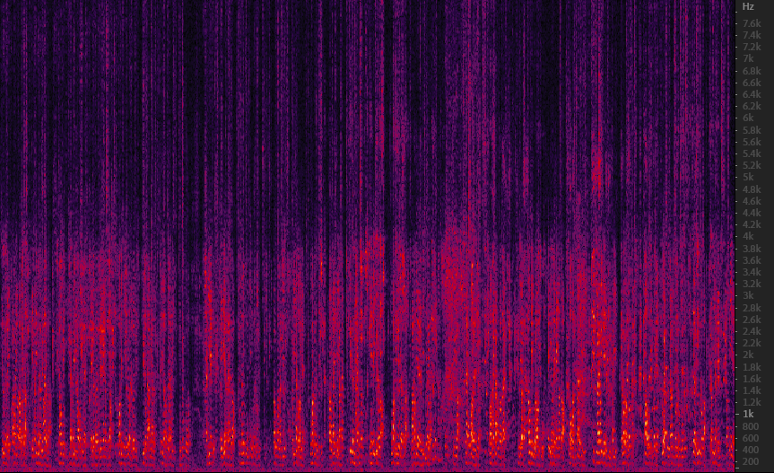
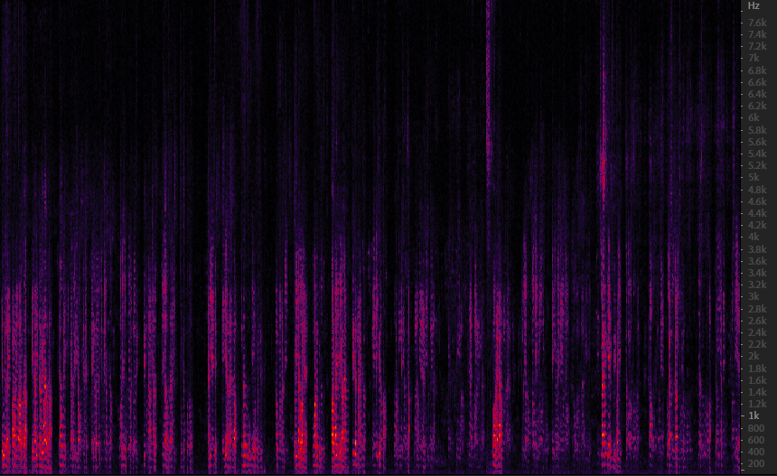
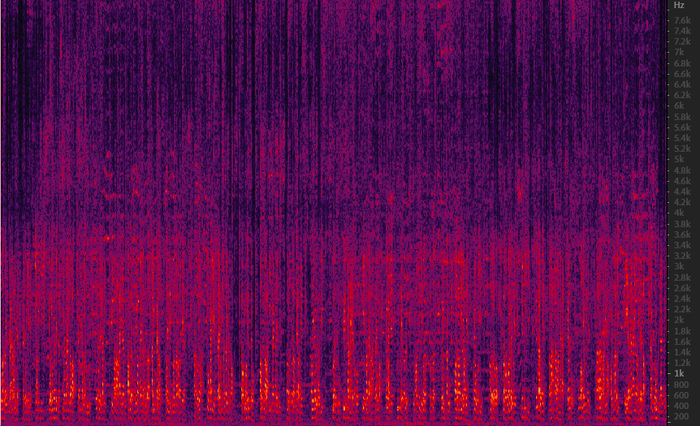
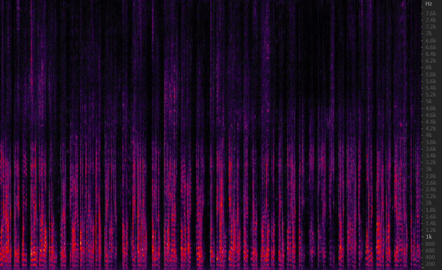

 &nbsp; When people are talking, there may be some interfer such as video and music around them, which may lead to the decrease of ASR, the algorithm in this program can be used to enhance the voice of speaker based on their direction.
 &nbsp;The audio in this folder named with **before** is the original audio, which was collected using a 6-channel circular microphone array in office, while the audio named with **after** is the  enhanced audio by the neural network. 
 &nbsp;There is a man who is talking with video interfer and music interfer, the audio named with **video** stand for TV interfer, with **music** stand for music interfer, **50** means the speaker is 50° relative to the reference microphone.

  &nbsp; The spectrum of the collected audio with video interfer is shown in Fig.1, (a) is the raw wave spectrum, (b) is the spectrum of the speech processed by the neural network.
  
|  |  |
|:---:|:---:|
| (a) | (b) |

Fig.1 video interfer

  &nbsp; The wave spectrum of  the collected audio with music interfer is shown in Fig.2, (a) is the raw wave spectrum, (b) is the spectrum of the clean speech processed by the neural network.
  
|  |  |
|:---:|:---:|
| (a) | (b) |

Fig.2 music interfer

