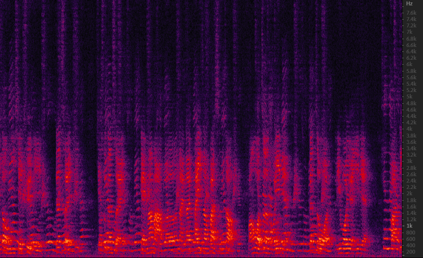
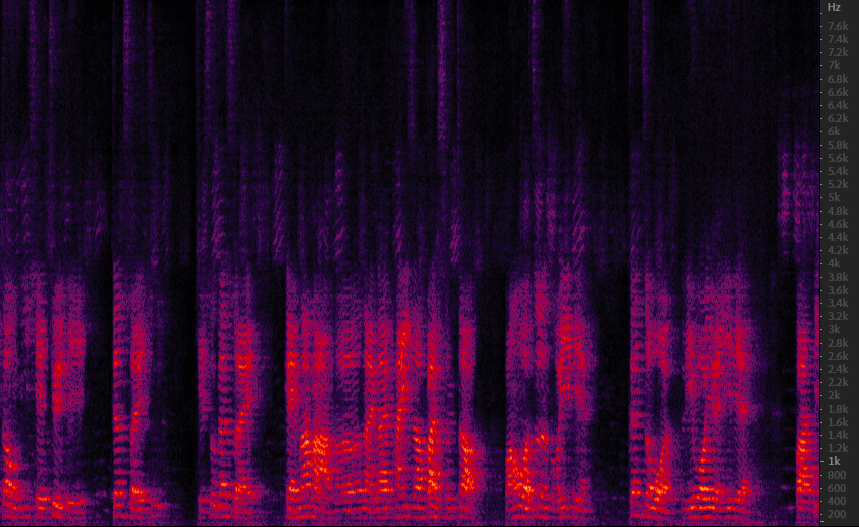
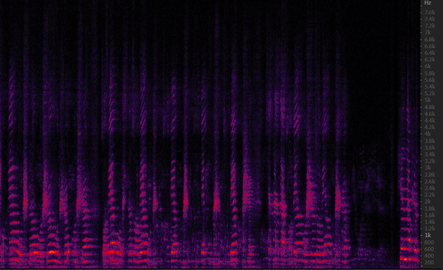

  &nbsp; The program can select  the speaker in the target direction, the audio “raw_inter_130_speaker_210.wav” is the original audio, which was collected using a 6-channel microphone array. 
  &nbsp; There are two people talking at the same time, the man is located at 210° relative to the reference microphone, while the girl is at 130°.The spectrum of the collected original audio
signal of mic1 is as shown in Fig.1.

Fig.1 Raw wav spectrum

&nbsp; After using the neural network proposed in this program to choose the speaker based on his or her location relative to the reference microphone,we can get the audio of the target speaker. 

&nbsp; The audio named “inter_130_speaker_210.wav”  is the selected audio of the man, the spectrum of it is shown in Fig.2.

Fig.2 Man's audio spectrum

&nbsp; The audio named “inter_210_speaker_130.wav” is the audio of the woman selected by the network.The spectrum of it is shown in Fig.3.

Fig.3 Woman's audio spectrum

 
