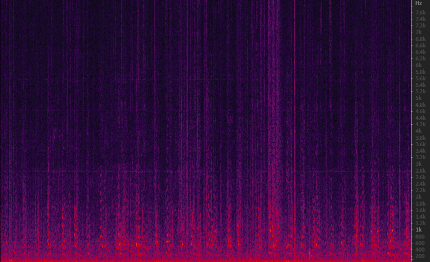

 &nbsp; When people are talking in a noisy environment, it can be used to reduce noise and obtain clean speaker audio.
 &nbsp;The audio named without **after** is the original audio, which was collected using a 6-channel microphone array in office. 
 &nbsp;**M** stand for man, **3m** means the speaker is 3m away from the center of the microphone array,**350** means the speaker is 350° relative to the reference microphone.

  &nbsp; The audio spectrum of the second people is shown in Fig.2,(a) is the raw wave, (b) is the spectrum of clean speech processed by this program.

  
  

Fig.2 speak2

&nbsp; After using McNet to choose the speaker based on his or her location relative to the reference microphone,we can get the audio of the target speaker. 

&nbsp; The audio named “inter_130_speaker_210.wav”  is selected by McNet, which is the man's speak audio.The spectrum of it is as shown in Fig.2.

Fig.2 Man's audio spectrum

&nbsp; The audio named “inter_210_speaker_130.wav”  is selected by McNet, which is the woman's speak audio.The spectrum of it is as shown in Fig.3.

Fig.3 Woman's audio spectrum

