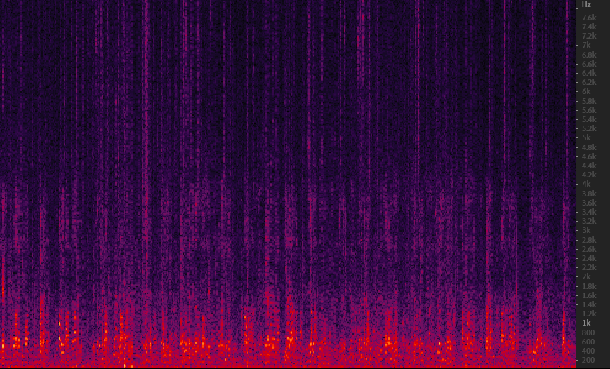
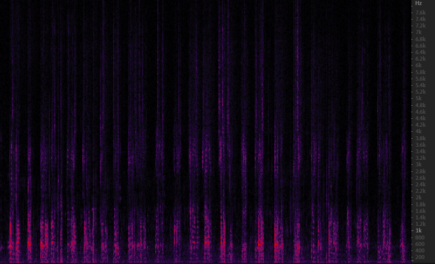

 &nbsp; When people are talking in a noisy environment, it can be used to reduce noise and obtain clean speech signal of the speaker in the target direction.
 &nbsp;The audio named without **after** is the original audio, which was collected using a 6-channel microphone array in office. **M** stand for man while **F** stand for female, **3m** means the speaker is 3m away from the center of the microphone array,**350** means the speaker is locate at 350° relative to the reference microphone.

  &nbsp; The audio spectrum of the first people is shown in Fig.1,(a) is the spectrum of original audio, (b) is the spectrum of the denoised audio processed by this program.
  
|  |  |
|:---:|:---:|
| (a) | (b) |

Fig.1 speak1

  &nbsp; The audio spectrum of the second people is shown in Fig.2,(a) is the spectrum of original audio, (b) is also the spectrum of the denoised audio processed by this program.
  
|  |  |
|:---:|:---:|
| (a) | (b) |

Fig.2 speak2

